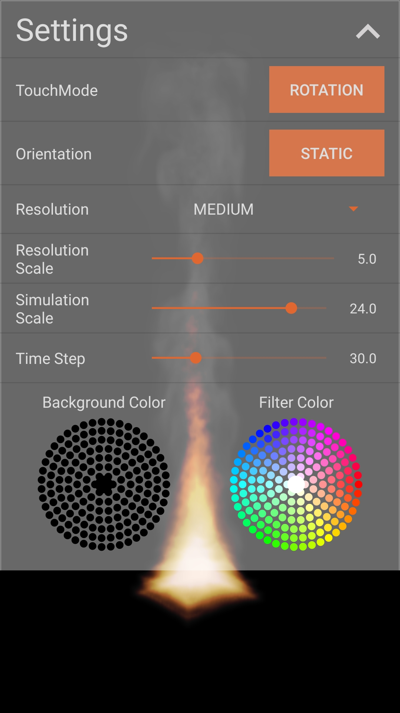

# DATX02-20-21

    

DATX02-20-21 Physically-based animation of fire in real-time

 Google Play: https://play.google.com/store/apps/details?id=com.anton.datx02_20_21

 Thesis: https://odr.chalmers.se/items/3900d873-0670-4339-b130-ac2ba1dba38f

<table>
  <tr>
    <td>
         
    </td>
    <td>
        
    </td>
  </tr>
</table>
